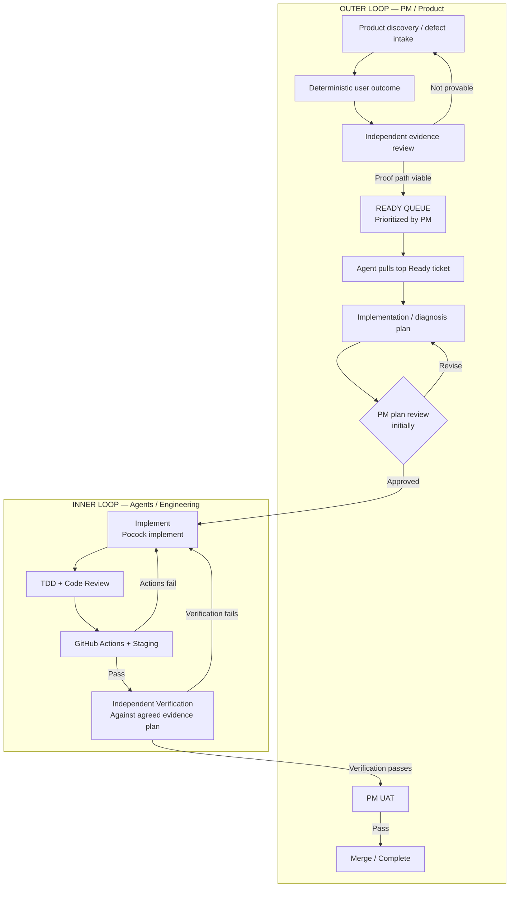
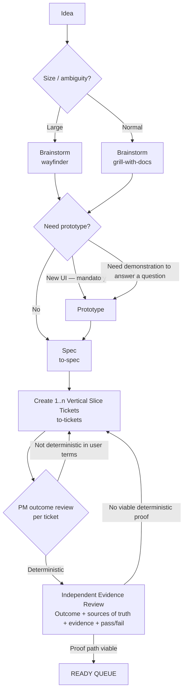
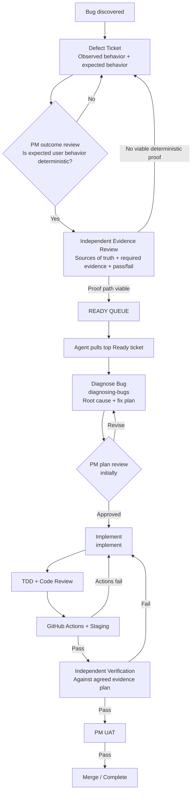
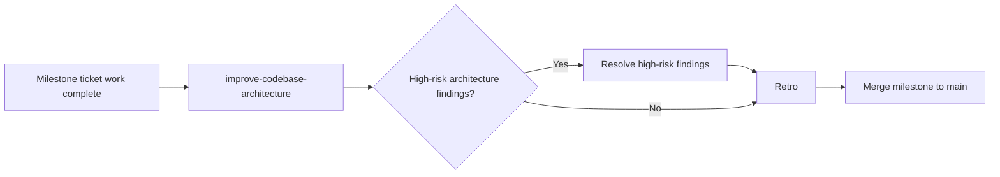

# C-C — Pocock Skills Integration (revised scoping pass)

Source: `mattpocock/skills` (github.com/mattpocock/skills), MIT licensed.
Current promoted catalog reviewed 2026-08-17: 25 skills.

This revision replaces the original flat “map skills to 12 process steps” framing. The review showed that the process itself needed to be clarified first. Pocock skills are now mapped to the process only after the enhancement path, defect path, Ready gate, inner/outer loops, and milestone closeout are defined.

**Not yet verified:** whether either repo (`toddwyder/AI-Stack`, `toddwyder/Julia`) already has the skills installed or `setup-matt-pocock-skills` has been run. Verify live before creating migration work so we do not duplicate existing setup.

---

## 1. What C-C must establish

C-C answers four questions:

1. What is the minimum development process for enhancements and defects?
2. Which Pocock skills are required or useful inside that process?
3. Which skills should become standing agent instructions rather than workflow steps?
4. What capabilities remain outside Pocock and must be supplied by AI-Stack itself?

The goal is **not** to force every Pocock skill into the process. The process comes first; skills are used only where they solve an actual need.

---

## 2. Operating model: PM outer loop + agent inner loop

The process is a pull system.

The PM's job is to keep a prioritized Ready queue supplied with work that is deterministic in user terms and can be deterministically proven. Agents pull from the top of that queue when capacity is available. The PM may reorder the queue at any time, including inserting defect fixes ahead of enhancement work.

The engineering agents own the implementation/verification correction loop. The PM should not have to enter that loop to perform forensic QA. Work returns to the PM only after the agreed verification evidence passes.

### Outer-loop responsibilities

The PM owns:

- product intent;
- the deterministic user outcome for each ticket;
- Ready approval on a per-ticket basis;
- Ready-queue ordering and reprioritization;
- implementation-plan review initially;
- UAT.

The independent reviewer owns the evidence gate required to earn Ready and the verification review after implementation.

### Inner-loop exit condition

The inner loop does not exit because the implementer says the work is finished. It exits only when the independent verification review confirms that the agreed evidence passes against the agreed sources of truth.

---

## 3. Ready is a per-ticket quality gate

A spec may create many vertical-slice tickets. **Ready is earned individually by each ticket.**

A ticket is Ready only when both conditions are true:

1. **Deterministic user outcome** — the PM can state unambiguously what the user should be able to observe or accomplish.
2. **Viable deterministic proof** — an independent reviewer confirms that there is a credible way to prove that outcome before implementation begins.

The evidence plan must identify, at minimum:

- the user-observable outcome being proved;
- the authoritative source(s) of truth;
- the evidence needed to establish the outcome;
- the pass/fail condition.

The process deliberately does **not** prescribe a narrow evidence method. Valid proof may come from tests, browser behavior, APIs, database state, logs, diffs, screenshots, telemetry, or another method appropriate to the claim. What matters is whether the evidence deterministically establishes the user outcome from an authoritative source of truth.

If no viable deterministic proof can be defined, the ticket does **not** enter Ready. This prevents verification ambiguity from being discovered only after repeated implementation loops.

---

## 4. Enhancement path

Enhancements begin with an idea and move through product discovery before they become tickets.

- Use `wayfinder` when the product problem is large enough to require a substantial exploration/planning pass.
- Use `grill-with-docs` for the normal product-definition interview. The skill does not make product decisions; it asks questions so the PM can make them.
- **All new UI must be prototyped before development.** Do not leave new UI design to the implementation agent.
- `prototype` is also used conditionally when the PM cannot answer a product question without seeing a concrete demonstration of how something might work.
- `to-spec` turns the resolved idea and requirements into the durable spec.
- `to-tickets` segments the spec into one or more vertical-slice tickets.
- Each ticket then earns Ready independently through PM outcome review plus independent evidence review.

### Conditional design support during enhancement discovery

`domain-modeling` is used only when the product/design work exposes a domain-meaning problem, for example:

- two people use the same term to mean different things;
- one concept is overloaded and should be split;
- a hard-to-reverse domain decision may warrant an ADR.

It is not a required workflow step. `grill-with-docs` may drive it underneath when appropriate.

---

## 5. Defect path

Defects use a lighter front end than enhancements but converge on the same Ready gate, Ready queue, inner engineering loop, verification review, and UAT.

A defect normally starts with a ticket containing:

- observed behavior;
- expected behavior stated deterministically in user terms.

The ticket still must pass independent evidence review before Ready. For a defect, the evidence plan should be capable of proving the relevant behavior deterministically without prescribing one evidence technique.

After an agent pulls the ticket from Ready, the planning step uses `diagnosing-bugs` to establish root cause and a fix plan before implementation.

---

## 6. Implementation planning

Implementation planning is a distinct stage after an agent pulls a Ready ticket into In Process.

Initially, the PM reviews the plan before implementation begins. This is an intentional v1 control point. Once the process has demonstrated that plans are consistently trustworthy, the PM approval gate can be revisited rather than assumed away from the start.

For defects, planning begins with `diagnosing-bugs`.

For enhancements, planning may invoke `codebase-design` when module seams, interfaces, testability, or codebase shape are material to the implementation.

---

## 7. Standing agent instructions

Some Pocock skills are better expressed as **mandatory trigger rules** in agent instructions rather than as boxes in the workflow.

### `research` — mandatory whenever research is needed

Any research performed by an engineering agent must use the `research` skill. Do not substitute memory, casual browsing, or uncited ad hoc research when the work requires external facts, documentation, unfamiliar technology, current behavior, or other research.

The purpose is to make research durable and source-grounded rather than ephemeral agent reasoning.

### `codebase-design` — required for new modules / material module-boundary changes

Agent instructions should include the skill link and tell agents to consult `codebase-design` when creating a new module or materially reshaping module boundaries:

https://www.aihero.dev/skills-codebase-design

This is a standing trigger, not a mandatory step for every ticket.

### New UI — approved prototype required

If a ticket requires new UI and there is no approved prototype/design artifact, the implementation agent should not invent the UI during development. The work should return to product definition before Ready.

### `writing-for-agents` — AI-Stack instruction authoring

Use `writing-for-agents` when creating or materially revising durable instructions intended for agents, including `AGENTS.md`, harness instructions, evidence rules, skill-trigger rules, and workflow instructions.

This belongs in AI-Stack rather than Julia's normal per-ticket development workflow.

---

## 8. Milestone closeout

`improve-codebase-architecture` is a **mandatory milestone-level gate**, not a per-ticket step.

Run it after the milestone's ticket work is complete and before merging the milestone to `main`. Its purpose is to detect accumulated or high-risk architectural problems that individual ticket reviews may not expose.

High-risk findings are resolved before the retro. The retro happens **after** remediation so it can include latent architecture/process failures that only became visible during the milestone architecture review.

The architecture gate is not intended to force cleanup of every smell. The required bar is to avoid knowingly merging high-risk architectural problems into `main`.

---

## 9. Pocock skill disposition

### Core workflow skills

| Skill | Role |
| --- | --- |
| `wayfinder` | Large enhancement brainstorming / exploration |
| `grill-with-docs` | Normal product-definition interview; PM supplies the answers and owns decisions |
| `prototype` | Mandatory for all new UI; conditional when demonstration is needed to resolve a product question |
| `to-spec` | Convert resolved idea + requirements into durable spec |
| `to-tickets` | Segment a spec into one or more vertical-slice tickets |
| `diagnosing-bugs` | Defect diagnosis, root cause, and fix planning after a defect is pulled from Ready |
| `implement` | Main implementation skill |
| `tdd` | Implementation-level test discipline |
| `code-review` | Implementation/code review inside the agent engineering process; **not** a substitute for independent evidence verification |

### Mandatory standing rules when triggered

| Skill | Trigger |
| --- | --- |
| `research` | Mandatory whenever an engineering agent needs research |
| `codebase-design` | New modules or material module-boundary / seam / interface decisions |
| `writing-for-agents` | Creating or materially revising durable agent instructions in AI-Stack |

### Milestone gate

| Skill | Role |
| --- | --- |
| `improve-codebase-architecture` | Mandatory architecture review before milestone merge to `main`; remediate high-risk findings, then retro |

### Migration / intake

| Skill | Role |
| --- | --- |
| `triage` | Useful when importing Julia's roadmap / backlog into the new process; not the steady-state Ready state machine |

### Conditional utilities

| Skill | Role |
| --- | --- |
| `domain-modeling` | Use when domain language/concepts are ambiguous, overloaded, or require a hard-to-reverse domain decision |
| `handoff` | Use only when execution context must actually transfer: Claude → Codex, different directory/repo, colleague transfer, or side-task fork |
| `resolving-merge-conflicts` | Corner case for an active merge/rebase conflict with conflict markers present |
| `wizard` | Optional; potentially useful for guided UAT or one-off human procedures |

### Occasional human aids

| Skill | Role |
| --- | --- |
| `ask-matt` | Onboarding/router aid when first learning the skills |
| `grill-me` | Occasional deep interrogation for unusually ambiguous planning problems; no required usage |
| `teach` | PM learning aid when a technical concept is hard to understand |
| `wait-what` | PM comprehension escape hatch when an explanation is unnecessarily complex |

### Setup / no normal workflow role

| Skill | Role |
| --- | --- |
| `setup-matt-pocock-skills` | One-time setup only |
| `to-questionnaire` | No identified role in this process |
| `grilling` | Underlying model-invoked primitive; no explicit process decision needed |

---

## 10. What Pocock does not provide

Pocock skills are reusable execution capabilities **inside** the operating model. They do not themselves provide the entire process.

AI-Stack still must supply or define:

- the per-ticket Ready state and prioritized pull queue;
- the independent evidence-review gate before Ready;
- the evidence-plan artifact/representation;
- reviewer independence / two-harness or multi-model design;
- the independent verification review against agreed sources of truth;
- GitHub Actions + staging orchestration and automatic return to implementation on Actions failure;
- automatic return to implementation on verification failure;
- queue/state orchestration across the PM outer loop and agent inner loop;
- UAT/merge state transitions;
- milestone architecture gate orchestration;
- durable checkpoint/recovery behavior that is separate from the narrow `handoff` trigger.

This is the central conclusion of C-C: **Pocock supplies a strong library of implementation, discovery, design, and review skills, but AI-Stack owns the operating system around those skills.**

---

## 11. gsd-core dependency

C-D still needs to inventory what gsd-core currently contributes and what would be lost by sunsetting it.

C-C should not duplicate that inventory, but its final adoption decision remains subject to C-D confirming that no important state-management, traceability, planning, recovery, or other capability disappears without replacement.

Where a gsd-core capability is replaced by this process or by a Pocock skill, C-D should record it as replaced rather than independently redesigning it.

---

## 12. Migration implications

Implementation details should remain capability-oriented until the harness design is settled.

Do **not** prematurely encode the migration item as “install the Claude Code plugin in both repos.” The requirement is:

> Make the required Pocock skills available in the supported harness/repository environments, using them as shipped for v1 unless later evidence creates a reason to customize them.

`setup-matt-pocock-skills` is a one-time setup action wherever adoption requires it.

Before filing or amending migration issues, live-verify existing installation/setup state to avoid duplicate work.

---

## 13. Open items before C-C can close

1. Confirm C-A's two-harness / reviewer-independence design so `code-review` is not confused with independent verification.
2. Complete C-D's gsd-core capability/loss inventory and verify that nothing critical is being silently dropped.
3. Live-verify current skill installation/setup state in AI-Stack and Julia.
4. Convert the standing rules above into durable agent instructions using `writing-for-agents`.
5. Create/update capability-oriented migration issues only after the relevant harness/setup decisions are settled.
